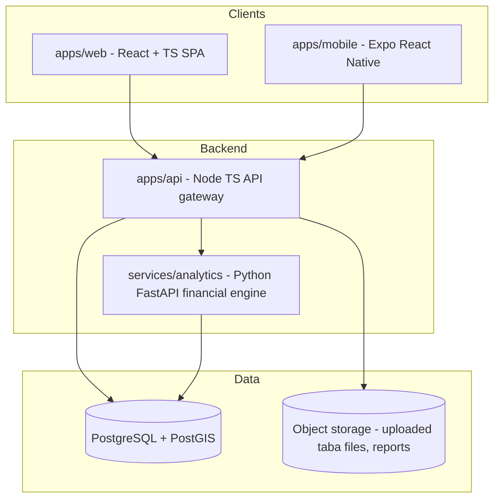

# Atlas — Architecture

Production architecture for **Atlas**, the Israeli urban renewal simulation platform (סימולטור התחדשות עירונית).
This replaces the ad-hoc prototype at the repository root (`frontend/`, `backend/`, `mobile/`), which stays
in place as a reference until migration completes (see [ADR-0007](adr/0007-keep-prototype-until-migration.md)).

## System overview

## Components and responsibilities

| Component | Tech | Responsibility |
|---|---|---|
| `apps/web` | React 18, TypeScript, Vite, Tailwind | Dashboard, map (Leaflet), 3D before/after (React Three Fiber), reports UI. RTL/Hebrew-first. |
| `apps/mobile` | Expo (React Native), TypeScript | Field-oriented subset: project list, map, project detail. |
| `apps/api` | Node 20+, TypeScript, Fastify | Single public API. AuthN/AuthZ, project CRUD, file import (CSV/XLSX/GeoJSON, cp1255 handling), orchestrates analytics calls, report generation. |
| `services/analytics` | Python 3.12, FastAPI, Pandas/NumPy/SciPy | Pure computation: IRR, NPV, payback, sensitivity analysis, scenario simulation. Stateless; internal-only (not exposed to the internet). |
| `packages/shared` | TypeScript | Domain types, Zod validation schemas, taba column mappings (Hebrew → English), i18n resources. Shared by web, mobile, api. |
| `packages/config` | — | Shared tsconfig/ESLint/Prettier presets so all workspaces lint and compile identically. |
| PostgreSQL + PostGIS | — | System of record: users, projects, imported plan data, scenarios, computed results. PostGIS for project geometry/geo queries. |
| Object storage | S3-compatible | Raw uploaded files and generated PDF/XLSX reports. Never stored in the DB or the repo. |

## Key rules

1. **One public API.** Clients talk only to `apps/api`. The Python service is an internal dependency of the
   API, never called from the browser (the prototype exposed both — see [ADR-0003](adr/0003-python-analytics-service.md)).
2. **Computation is stateless.** `services/analytics` receives inputs, returns results, owns no client state.
   This keeps the numeric engine independently testable against golden fixtures.
3. **Shared contracts.** Request/response shapes live in `packages/shared` as Zod schemas; the API validates
   with them and the clients import the inferred types. The analytics service's contract is pinned by its
   OpenAPI schema and contract tests.
4. **Hebrew data is a first-class concern.** Encoding (Windows-1255), RTL rendering, and the taba column
   mapping table are centralized in `packages/shared`, not re-implemented per app.

## Data flow: the core loop

1. User uploads a taba/PIO file → API parses (encoding detection, column mapping) → normalized rows stored in Postgres, raw file in object storage.
2. User configures a scenario (apartment mix, costs, prices) → API persists it and calls analytics.
3. Analytics computes IRR/NPV/payback/sensitivity → API stores results against the scenario.
4. Web/mobile render dashboards, maps, 3D comparison; report generation exports PDF/XLSX from stored results.

## Cross-cutting

- **AuthN/AuthZ**: JWT-based sessions issued by the API; role model in [SECURITY.md](SECURITY.md).
- **Observability**: structured JSON logs (pino / structlog), request IDs propagated API → analytics, health endpoints (`/healthz`, `/readyz`) on both services.
- **Configuration**: 12-factor, env vars only, validated at boot (Zod / Pydantic Settings). No secrets in the repo.

## Decision log

Every non-obvious choice has an ADR in [`docs/adr/`](adr/). Start with
[ADR-0001](adr/0001-monorepo-structure.md).
